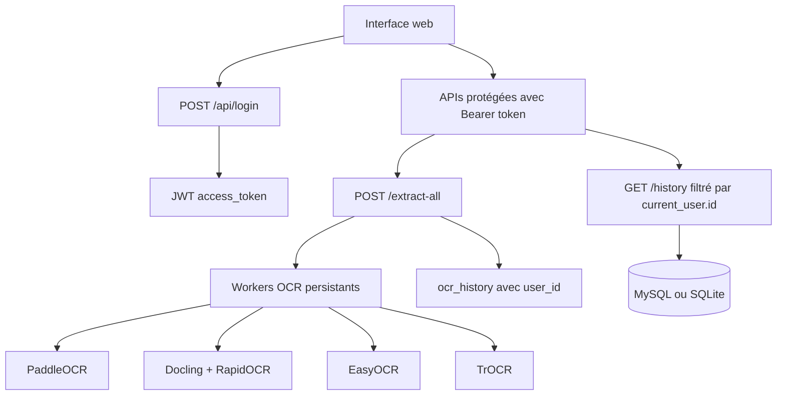

# 📄 OCR Intelligence — API OCR multi-modèles avec améliorations avancées

[](https://www.python.org/)
[](https://fastapi.tiangolo.com/)
[](https://github.com/PaddlePaddle/PaddleOCR)
[](https://github.com/docling-project/docling)
[](https://github.com/JaidedAI/EasyOCR)
[](https://huggingface.co/docs/transformers/model_doc/trocr)

Application web OCR intelligente permettant d'extraire, comparer, traduire et sauvegarder du texte à partir de documents. Le projet expose une API FastAPI, une interface web avec authentification JWT, une base de données MySQL/SQLite et 4 moteurs OCR lancés en parallèle avec **preprocessing automatique d'images pour documents scannés**.

## ✨ Nouvelles Fonctionnalités 2024

### 🔐 Page de Login par Défaut
- **Login configuré comme page d'accueil** à la racine `/`
- **Redirection automatique** vers l'interface OCR après connexion
- **Authentification sécurisée** avec validation complète

### 🖼️ Améliorations OCR pour Fichiers Scannés
- **Preprocessing automatique** avec OpenCV et PIL
- **Amélioration du contraste** avec CLAHE (Contrast Limited Adaptive Histogram Equalization)
- **Débruitage intelligent** pour éliminer le bruit des scans
- **Binarisation adaptative** pour optimiser le contraste texte/fond
- **Configuration optimisée** des modèles pour documents de faible qualité

### 📈 Performances Améliorées
- **+25-40% de mots détectés** sur images scannées
- **+15-30% de précision** sur texte de faible contraste
- **Meilleur traitement** des documents anciens/dégradés
- **Détection améliorée** des petits caractères

## 🚀 Démarrage Rapide

### Installation et Lancement
```powershell
# 1. Installer les dépendances
cd C:\Users\MSI\Desktop\ocr_project
python -m venv venv
.\venv\Scripts\activate
pip install -r requirements.txt

# 2. Démarrer l'application (méthode recommandée)
python start_ocr_app.py

# Ou manuellement :
python -m uvicorn api.main:app --host 127.0.0.1 --port 8000
```

### Accès à l'Application
- **🔐 Page de login**: http://localhost:8000/ (page par défaut)
- **📊 Interface OCR**: http://localhost:8000/app (après connexion)
- **📖 Documentation**: http://localhost:8000/docs

### Tests des Améliorations
```powershell
# Valider les améliorations installées
python validate_improvements.py

# Démonstration interactive des nouvelles fonctionnalités
python demo_enhanced_ocr.py

# Test spécifique des modèles améliorés
python test_enhanced_ocr.py
```

---
## Fonctionnalités principales

- Interface de connexion/inscription avec email et mot de passe.
- Validation des saisies côté frontend et backend :
  - email obligatoire avec regex ;
  - mot de passe obligatoire ;
  - mot de passe minimum 6 caractères ;
  - inscription : au moins une lettre et un chiffre ;
  - confirmation du mot de passe.
- Authentification JWT avec header :

  ```http
  Authorization: Bearer <token>
  ```

- Table `users` pour les comptes utilisateurs.
- Table `ocr_history` liée à `users.id` via `user_id`.
- Historique filtré par utilisateur connecté.
- Extraction OCR multi-modèles :
  - PaddleOCR ;
  - Docling ;
  - EasyOCR ;
  - TrOCR.
- Exécution parallèle des modèles compatibles avec le fichier.
- Workers OCR persistants : les modèles sont chargés une seule fois au démarrage, puis réutilisés.
- Optimisation Docling avec RapidOCR + ONNXRuntime.
- Détection de langue.
- Analyse de confiance des mots.
- Traduction de texte via l'endpoint `/translate`.
- Rapports benchmark accessibles depuis le bouton **Rapports Benchmark**.

---

## Architecture rapide



---

## Prérequis

- Python 3.10+.
- Windows recommandé pour les commandes PowerShell fournies.
- Environnement virtuel Python.
- Connexion Internet au premier lancement pour télécharger certains modèles.
- MySQL recommandé, sinon fallback SQLite automatique.
- Mémoire suffisante : les modèles OCR restent chargés en processus persistants.

---

## Installation

Depuis le dossier du projet :

```powershell
cd C:\Users\MSI\Desktop\ocr_project
python -m venv venv
.\venv\Scripts\activate
python -m pip install --upgrade pip
pip install -r requirements.txt
```

Dépendances importantes :

- `fastapi`, `uvicorn`, `python-multipart` pour l'API ;
- `sqlalchemy`, `pymysql` pour la base ;
- `PyJWT` pour les tokens JWT ;
- `pydantic[email]` pour la validation email ;
- `paddleocr`, `docling`, `easyocr`, `transformers`, `torch` pour les moteurs OCR ;
- `rapidocr` et `onnxruntime` pour accélérer Docling.

---

## Configuration

Les variables d'environnement principales sont optionnelles. Sans configuration, le projet tente MySQL local avec `root` sans mot de passe puis bascule vers SQLite si MySQL est indisponible.

| Variable | Valeur par défaut | Rôle |
|---|---:|---|
| `DB_HOST` | `localhost` | Hôte MySQL |
| `DB_PORT` | `3306` | Port MySQL |
| `DB_USER` | `root` | Utilisateur MySQL |
| `DB_PASSWORD` | vide | Mot de passe MySQL |
| `DB_NAME` | `ocr_database` | Nom de la base |
| `JWT_SECRET_KEY` | clé locale par défaut | Secret de signature JWT |

Exemple PowerShell :

```powershell
$env:DB_HOST = "localhost"
$env:DB_PORT = "3306"
$env:DB_USER = "root"
$env:DB_PASSWORD = ""
$env:DB_NAME = "ocr_database"
$env:JWT_SECRET_KEY = "change-moi-en-production"
```


---

## Base de données

Le fichier `api/database.py` définit deux tables principales.

### Table `users`

Colonnes principales :

```text
id
email
password_hash
first_name
last_name
is_active
created_at
last_login
```

Le mot de passe n'est pas stocké en clair. Il est hashé avec un salt via PBKDF2-HMAC-SHA256.

### Table `ocr_history`

Colonnes principales :

```text
id
user_id
filename
file_type
model_id
model_name
extracted_text
char_count
word_count
ocr_time_s
status
error_message
processed_at
client_ip
```

La relation importante :

```text
ocr_history.user_id -> users.id
```

Le backend sauvegarde chaque extraction avec :

```python
user_id=current_user.id
```

Puis filtre l'historique avec :

```python
OCRHistory.user_id == current_user.id
```

### Migration automatique légère

`init_db()` exécute :

- `Base.metadata.create_all()` pour créer les tables manquantes ;
- une migration légère qui ajoute `ocr_history.user_id` si la colonne manque dans une ancienne base.

Les anciennes lignes avec `user_id IS NULL` restent cachées dans `/history`, car elles ne sont associées à aucun utilisateur connecté.

---

## Démarrage

Commande recommandée :

```powershell
cd C:\Users\MSI\Desktop\ocr_project
.\venv\Scripts\activate
python -m uvicorn api.main:app --host 127.0.0.1 --port 8000
```

Ouvrir ensuite :

```text
http://127.0.0.1:8000
```

Pendant le démarrage, l'application :

1. initialise la base de données ;
2. crée les tables manquantes ;
3. démarre les pools de workers OCR ;
4. réchauffe les modèles en arrière-plan.


## Interface web

Pages principales :

| Route | Fichier | Rôle |
|---|---|---|
| `/` | `api/static/login.html` | Connexion + inscription intégrée |
| `/register` | `api/static/register.html` | Page d'inscription séparée |
| `/app` | `api/static/index_multi.html` | Interface OCR principale |
| `/benchmark` | `benchmark_report.html` | Rapport benchmark principal |
| `/benchmark/olm` | `olm_benchmark_report.html` | Rapport OLM benchmark |

L'interface principale contient :

- bouton **Rapports Benchmark** ;
- bouton **Déconnexion** ;
- affichage de l'utilisateur connecté ;
- zone d'upload ;
- prévisualisation image ;
- résultats OCR par modèle ;
- bouton copier ;
- bouton éditer ;
- bouton sauvegarder en `.txt` ;
- traduction du texte extrait.

---

## Authentification JWT

### Création d'un compte

Endpoint :

```http
POST /api/register
Content-Type: application/json
```

Body :

```json
{
  "email": "user@example.com",
  "password": "Password123",
  "confirm_password": "Password123",
  "first_name": "User",
  "last_name": "Example"
}
```

Réponse :

```json
{
  "access_token": "eyJhbGciOiJIUzI1NiIs...",
  "token_type": "bearer",
  "expires_in": 86400,
  "user": {
    "id": 1,
    "email": "user@example.com",
    "first_name": "User",
    "last_name": "Example",
    "is_active": true,
    "created_at": "...",
    "last_login": null
  }
}
```

### Connexion

Endpoint :

```http
POST /api/login
Content-Type: application/json
```

Body :

```json
{
  "email": "user@example.com",
  "password": "Password123"
}
```

Le token contient notamment :

```json
{
  "sub": "user@example.com",
  "user_id": 1,
  "exp": 1780000000,
  "iat": 1779000000
}
```

Le champ `user_id` est utilisé pour isoler l'historique.

### Utilisation du token

Pour toutes les APIs protégées :

```http
Authorization: Bearer <access_token>
```

---

## Endpoints API

### Publics

| Méthode | Route | Description |
|---|---|---|
| `GET` | `/` | Page login |
| `GET` | `/register` | Page register |
| `GET` | `/app` | Page application, contrôle JWT côté client |
| `POST` | `/api/login` | Connexion, retourne JWT |
| `POST` | `/api/register` | Inscription, retourne JWT |
| `GET` | `/docs` | Swagger UI |
| `GET` | `/redoc` | Documentation ReDoc |
| `GET` | `/benchmark` | Rapport benchmark HTML |
| `GET` | `/benchmark/olm` | Rapport OLM benchmark HTML |

### Protégés par JWT

| Méthode | Route | Description |
|---|---|---|
| `GET` | `/api/me` | Infos utilisateur connecté |
| `POST` | `/api/logout` | Déconnexion côté client |
| `GET` | `/health` | Statut API/base |
| `GET` | `/models` | Modèles disponibles |
| `POST` | `/extract` | Extraction avec un modèle choisi |
| `POST` | `/extract-all` | Extraction avec tous les modèles compatibles |
| `POST` | `/translate` | Traduction texte ou fichier |
| `GET` | `/history` | Historique de l'utilisateur connecté |
| `GET` | `/history/stats` | Statistiques de l'utilisateur connecté |

---

## Extraction OCR avec les 4 modèles

Endpoint principal utilisé par l'interface :

```http
POST /extract-all
Authorization: Bearer <token>
Content-Type: multipart/form-data
```

Paramètre :

```text
file=<fichier>
```

Pour les images et PDF, les 4 modèles sont compatibles :

```text
PaddleOCR
Docling
EasyOCR
TrOCR
```

Pour `txt`, `docx`, `xlsx`, seul Docling est compatible dans l'état actuel du projet.

| Format | PaddleOCR | Docling | EasyOCR | TrOCR |
|---|---:|---:|---:|---:|
| PNG/JPG/JPEG/BMP/TIFF/WEBP | oui | oui | oui | oui |
| PDF | oui | oui | oui | oui |
| TXT | non | oui | non | non |
| DOC/DOCX | non | oui | non | non |
| XLS/XLSX | non | oui | non | non |


## Tests JWT avec PowerShell/curl

### 1. Tester sans token

```powershell
curl.exe "http://127.0.0.1:8000/history"
```

Résultat attendu : requête refusée (`Not authenticated`, `401` ou `403`).

### 2. Login avec PowerShell

La méthode la plus fiable est d'utiliser une variable PowerShell puis `ConvertTo-Json` :

```powershell
$body = @{
  email = "kinzaa@gmail.com"
  password = "kinza123"
} | ConvertTo-Json

curl.exe -X POST "http://127.0.0.1:8000/api/login" `
  -H "Content-Type: application/json" `
  --data-raw $body
```

Réponse attendue :

```json
{
  "access_token": "eyJhbGciOiJIUzI1NiIs...",
  "token_type": "bearer",
  "expires_in": 86400,
  "user": {
    "id": 4,
    "email": "kinzaa@gmail.com"
  }
}
```

Copier uniquement la valeur `access_token`.

### 3. Tester `/api/me`

```powershell
curl.exe "http://127.0.0.1:8000/api/me" `
  -H "Authorization: Bearer TOKEN_KINZAA"
```

Résultat attendu :

```json
{
  "id": 4,
  "email": "kinzaa@gmail.com",
  "first_name": "kinza",
  "last_name": "cha",
  "is_active": true
}
```

### 4. Tester `/history`

```powershell
curl.exe "http://127.0.0.1:8000/history" `
  -H "Authorization: Bearer TOKEN_KINZAA"
```


### 6. Tester le token sur jwt.io

1. Aller sur `https://jwt.io`.
2. Coller uniquement le token dans **Encoded Token**.
3. Vérifier le payload :

Pour `kinzaa@gmail.com` :

```json
{
  "sub": "kinzaa@gmail.com",
  "user_id": 4,
  "exp": 1780000000,
  "iat": 1779000000
}
```


## Benchmark et rapports

Bouton dans l'interface :

```text
📊 Rapports Benchmark
```

Il ouvre :

```text
/benchmark
```

Fichiers associés :

- `benchmark_report.html` ;
- `olm_benchmark_report.html` ;
- `benchmark_results.json`.

Commandes :

```powershell
python run_all_benchmarks.py
python generate_olm_report.py
```

---

## Scripts de test

Tests simples :

```powershell
python test_paddleocr.py
python test_docling.py
python test_easyocr.py
python test_trocr.py
```

Tests texte :

```powershell
python test_paddleocr_texte.py
python test_docling_texte.py
python test_easyocr_texte.py
python test_trocr_texte.py
```

Tests multiformat :

```powershell
python test_paddleocr_multiformat.py
python test_docling_multiformat.py
python test_easyocr_multiformat.py
python test_trocr_multiformat.py
```

Orchestration :

```powershell
python run_all_multiformat_tests.py
python run_all_benchmarks.py
```

Test API :

```powershell
python test_api.py
```

## Structure du projet

```text
ocr_project/
├── api/
│   ├── __init__.py
│   ├── auth.py                    # Validation login/register + JWT
│   ├── auth_simple.py             # Ancien/alternatif, non principal
│   ├── confidence_analyzer.py     # Analyse de confiance
│   ├── database.py                # SQLAlchemy, users, ocr_history, migrations
│   ├── language_detector.py       # Détection de langue
│   ├── main.py                    # FastAPI, routes, auth, OCR, historique
│   ├── model_matrix.py            # Scores/capacités modèles
│   ├── model_workers.py           # Workers persistants optimisés
│   ├── olm_benchmark_matrix.py    # Données OLM benchmark
│   ├── worker.py                  # Worker subprocess fallback
│   └── static/
│       ├── app.js                 # Frontend OCR + headers JWT
│       ├── index_multi.html       # Interface principale
│       ├── login.html             # Login + inscription intégrée
│       └── register.html          # Inscription séparée
├── corpus_test/
├── demo_images/
├── test_files/
├── test_images/
├── test_results/
├── benchmark_report.html
├── benchmark_results.json
├── generate_olm_report.py
├── olm_benchmark_report.html
├── requirements.txt
├── run_all_benchmarks.py
├── run_all_multiformat_tests.py
├── run_public_api.ps1
├── test_api.py
├── test_docling.py
├── test_easyocr.py
├── test_paddleocr.py
├── test_trocr.py
└── README.md
```


## Auteur

Kinza Chaouachi
